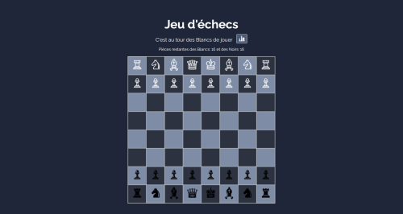
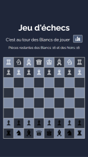

# ♟️CHESS (JEU D'ECHECS)

Chess est un jeu d'échecs développé en JavaScript qui permet de jouer contre un autre joueur. Il utilise des concepts de programmation orientée objet (POO) et plusieurs design patterns pour garantir une architecture modulaire et extensible.

- **But du jeu:** Mettre le roi adverse en échec et mat.
- **Interface:** Le jeu s'affiche dans un canevas HTML avec des interactions basées sur des événements JavaScript. 


♟️Ce jeu est déployé sur Netlify: 🔗[Jouer aux échecs en ligne]()

---


## Aperçu 

<span style="display: flex; gap: 3rem;">
 
 
</span>

---


## 1. Installation 

```
git clone https://github.com/Melissa-code/chess.git
cd chess
```

- Ouvrir le fichier `index.html` dans le navigateur pour commencer à jouer 
---


## 2. Technologies utilisées

- **[HTML](https://developer.mozilla.org/fr/docs/Web/HTML)**: structure du jeu
- **[CSS](https://developer.mozilla.org/fr/docs/Web/CSS)**: design et mise en page de l'interface
- **[JavaScript](https://developer.mozilla.org/fr/docs/Web/JavaScript)**: logique du jeu et gestion des interactions
- **[Canvas API](https://developer.mozilla.org/en-US/docs/Web/API/Canvas_API)**: affichage graphique du jeu sur un canevas

---

## 3. Architecture et patterns : 

### 3.1. Architecture 

Structure du projet :
```
📂 chess
┣ 📜 index.html → Structure du jeu
┣ 📜 style.css → Styles et mise en page
┣ 📂 model → Contient les classes du jeu 
│ ┣ 📜 Cavalier.js 
│ ┣ 📜 Echiquier.js
│ ┣ 📜 Fou.js 
│ ┣ 📜 Piece.js 
│ ┣ 📜 PieceFactory.js 
│ ┗ 📜 Pion.js 
│ ┗ 📜 Reine.js 
│ ┗ 📜 Roi.js 
│ ┗ 📜 Tour.js
┣ 📜 View.js → Gère l'affichage du jeu et les interactions utilisateur
┗ 📜 controller.js → Point d’entrée, initialise le jeu et la logique principale
┗ 📜 images → Contient les images du jeu
```


### 3.2. Patterns 

##### - 1. MVC (Model-View-Controller)

Séparation claire des responsabilités:
  - `models/` contient la logique du jeu (Modèle) 
  - `Vue.js` gère l'affichage et l'interface utilisateur (Vue)
  - `controller.js` relie la logique du jeu et l'affichage en gérant les interactions (Contrôleur)

➡️ Le pattern MVC permet de séparer la logique métier de l’affichage, facilitant ainsi la maintenance et l’évolution du projet.


##### - 2. Factory Pattern

Création dynamique des pièces:
  - `PieceFactory.js` est une fabrique qui qui génère dynamiquement les différentes pièces du jeu en fonction de leur type, couleur et position. 

➡️ Le pattern Factory permet d'ajouter facilement de  sans modifier le code principal.


##### - 3. Observer Pattern

Synchronisation automatiquement la vue avec les modifications du modèle:
- à chaque fois que l'état du modèle change (ex: le déplacement d'une pièce), la vue est automatiquement mise à jour pour refléter ce changement, garantissant ainsi que l'affichage reste toujours cohérent avec l'état du jeu. 

➡️ L'Observer Pattern permet une réactivité de l'interface sans avoir besoin d'interroger manuellement l'état du modèle à chaque instant.

--- 


## 4. Algorithmes 

### 4.1. Gestion des pièces

Chaque pièce du jeu est représentée par un objet dérivé de la classe `Piece`. Toutes les pièces partagent des propriétés communes mais elles comportent des comportements différents en fonction de leurs mouvements et de leur logique de prise.

#### 1. Propriétés de la classe Piece

- `Couleur`: la couleur de la pièce (noir ou blanc)
- `Symbole Unicode`: chaque pièce a un symbole unique qui la représente, par exemple ♙ pour un pion blanc - [cf. Symboles Unicode pour les échecs](https://citizendium.org/wiki/Chess_symbols_in_Unicode)
- `Position`: la position de la pièce sur l'échiquier

Les classes spécifiques aux pièces héritent de cette classe et implémentent leurs propres règles de déplacement.

#### 2. Les classes filles

- `Pion, Tour, Cavalier, Fou, Reine, Roi`
- Chaque classe implémente sa propre méthode de déplacement.


### 4.2. Déplacements des pièces

Chaque type de pièce a sa propre logique de déplacement mais la vérification des mouvements suit un processus similaire pour chaque pièce:

1. `canMove(echiquier, i, j`vérifie si le déplacement est valide en fonction des règles du jeu.

2. `canAttack(echiquier, i, j) ` vérifie si la pièce peut attaquer une autre pièce à la position donnée. **Cette méthode est différente pour le pion** car il attaque en diagonale.


### 4.3. La PieceFactory

Lorsqu'une nouvelle pièce doit être placée sur l'échiquier, la méthode `createPiece()` est appelée avec les paramètres nécessaires (type, couleur, position).


### 5.3. Logique du jeu: l’Echiquier

L’échiquier est représenté par une liste de pièces où chaque case peut contenir une référence à une pièce (ou null si la case est vide)

#### 1. Déplacement d'une pièce

- Lorsqu'un joueur choisit une pièce et clique sur une case cible, la méthode `deplacerPiece(piece, i, j` est appelée pour effectuer le déplacement.

- Si la case est occupée par une pièce ennemie, cette dernière est "capturée" et retirée de l’échiquier.

#### 2. Validation des mouvements

- Chaque mouvement est validé par la méthode `canMove()` de la pièce avant d’être effectué.

- Le jeu vérifie si un mouvement met le roi en échec ou si une prise est possible.

#### 3. Fin de la partie 

- Le jeu se termine lorsqu’un des joueurs met l’autre en `echec et mat`. Si un joueur n'a plus de pièces ou si le roi est capturé alors la partie se termine.

--- 

## 5. Affichage et interactions

### 5.1. La classe View

La classe View.js est responsable de l'affichage de l'échiquier et des pièces sur l'écran. Elle interagit avec l'élément ***`<canvas>`*** pour dessiner l’échiquier et les pièces.


#### 1. Affichage de l’échiquier 

- L’échiquier est représenté sous forme de grille avec des cases alternées de couleurs claires et foncées.

- Les pièces sont dessinées sur leurs cases respectives en utilisant leurs symboles Unicode.

#### 2. Mise à jour de la vue 

- Lorsque l'état du modèle change, par exemple: lorsqu'une pièce se déplace, la vue est mise à jour pour refléter ces changements grâce à l'Observer Pattern.

#### 3. Interactions utilisateur 

- Lorsque l'utilisateur clique sur une case du canevas, la méthode `clickOnCanva()` est appelée pour gérer les interactions et mettre à jour l'échiquier.


### 5.2. Affichage dynamique des pièces et du tour du joueur

Le jeu affiche en temps réel le `tour du joueur`, `les pièces restantes` et `les messages d'échec et mat` via des éléments HTML et CSS. Ces informations sont mises à jour dynamiquement lorsque l'état du jeu change.

---


## 6. Conclusion 

Ce projet met en pratique plusieurs concepts fondamentaux du développement web et de l'algorithmique:

- **Manipulation des structures de données**: utilisation d'une liste de pièces[ ] pour représenter l'échiquier et les mouvements des pièces.

- **Design Patterns:** application des patterns MVC, Factory, et Observer pour garantir une architecture modulaire, extensible et réactive.

- **Algorithmes:** gestion des règles du jeu, des déplacements et des attaques des pièces ainsi que de la détection des situations d'échec et mat.

- **Gestion des événements utilisateurs**: interaction avec l'interface utilisateur via des événements JavaScript pour déplacer les pièces et mettre à jour l'affichage en temps réel.

---


## 7. Author 

- Melissa-code


