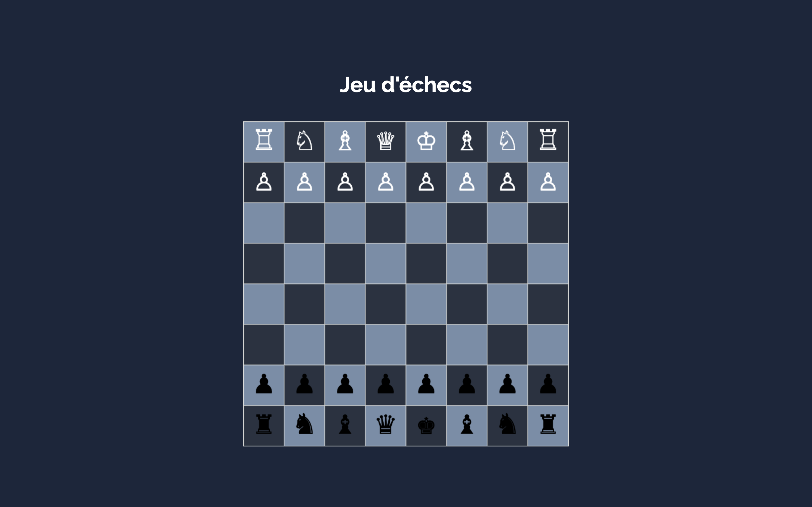

# **CHESS (JEU D'ECHECS)**

Ce projet implémente un jeu d'échecs en JavaScript basé sur une architecture modulaire et extensible avec l'utilisation de plusieurs design patterns adaptés.

---

## **Architecture logicielle et design patterns** :

Ce projet repose sur plusieurs concepts d'architecture logicielle pour garantir flexibilité et maintenabilité :

1. **Modèle MVC (Model-View-Controller)** :
   - Structure de base pour séparer les responsabilité;
   - Le **Modèle** gère la logique métier et l'état du jeu; 
   - La **Vue** s'occupe de l'affichage graphique (ou textuel);
   - Le **Contrôleur** fait l'interface entre les interactions utilisateur et le modèle; 

2. **Factory Pattern** :
   - Simplifie la création des pièces en instanciant les bonnes classes en fonction du type et de la couleur;

3. **Command Pattern** :
   - Gère les déplacements des pièces sous forme de commandes permettant des fonctionnalités comme l'annulation ou la répétition des coups;

4. **Observer Pattern** :
   - Permet de synchroniser automatiquement la vue avec les modifications du modèle;

---

## **Cycle d'exécution du jeu**

1. L'utilisateur clique sur une pièce (géré par le **Contrôleur**).  
2. Le **Contrôleur** interroge le **Modèle** pour valider le déplacement.  
3. Si le déplacement est valide, le **Modèle** met à jour l'état du jeu et notifie les **Observers**.  
4. La **Vue** se met à jour automatiquement grâce au **Observer Pattern**.  
5. Chaque déplacement est encapsulé dans une commande pour permettre des fonctionnalités avancées comme l'annulation ou la répétition.

---

## **Les pièces du jeu** :

### Une classe mère 

Toutes les pièces partagent des propriétés communes :
- Une **couleur** (blanc ou noir).
- Un **symbole** Unicode représentant la pièce (différent selon la couleur).

### Les classes filles  

Les classes spécifiques aux pièces d'échecs héritent de la classe mère, par exemple :
- **Pion**, **Tour**, **Cavalier**, **Fou**, **Reine**, **Roi**.
- Elles définissent le **symbole** en fonction de leur type et de leur couleur.

### Utilisation des symboles Unicode

Pour représenter les pièces, on utilise les codes Unicode spécifiques :
- Exemple : ♙ (pion blanc) correspond à `\u2659`, et ♟ (pion noir) correspond à `\u265F`.
- Référence complète des symboles Unicode pour les échecs : [Symboles Unicode pour les échecs](https://citizendium.org/wiki/Chess_symbols_in_Unicode).

---

## **Fabrication des pièces (Factory Pattern)**

La **factory** gère la création des pièces de manière centralisée.  
Elle instancie automatiquement la classe appropriée (Pion, Roi, etc.) en fonction du type et de la couleur spécifiés.

---

## **La matrice de jeu (échiquier avec des objets)**

Le plateau d'échecs est représenté sous la forme d'une **matrice 8x8**, où chaque case contient soit :
- Une référence à un objet de type **Piece** (Pion, Roi, etc.).
- `null` si la case est vide.

### Pourquoi une matrice ?

- **Simplifie les règles du jeu** : Les déplacements, la prise de pièces, ou la vérification d'un échec sont faciles à gérer.  
- **Extensibilité** : Une représentation matricielle facilite l'ajout de nouvelles fonctionnalités comme :
  - L'annulation ou la répétition des coups.
  - La gestion de l'historique des parties.

---

## Afficher l'échiquier (vide puis rempli des pièces)

### Étapes pour afficher l'échiquier :

1. **Créer une classe `View`** :  
   La classe `View` est responsable de la gestion de l'affichage de l'échiquier sur le canevas; 

2. **Utiliser un élément `<canvas>`** :  
   L'élément `<canvas>` est utilisé pour dessiner l'échiquier en créant un tableau de cases sur un plan 2D à l'aide de la méthode `fillRect`; 

3. **Définir la taille des cases** :  
   La taille des cases de l'échiquier est définie par la propriété `tailleCarreau` et est calculée en fonction de la matrice du modèle;

4. **Affichage des cases de l'échiquier** :  
   L'échiquier est dessiné en alternant les couleurs des cases (claires et foncées). Cela est réalisé en utilisant une boucle pour parcourir chaque ligne et colonne de la matrice et en coloriant chaque case en fonction de sa position;

5. **Affichage des pièces** :  
   Les pièces sont dessinées sur le canevas en utilisant le symbole Unicode correspondant à chaque type de pièce (pion, tour, cavalier, etc.). La couleur de chaque pièce est déterminée par sa couleur (`white` ou `black`) et elle est centrée sur la case correspondante;

